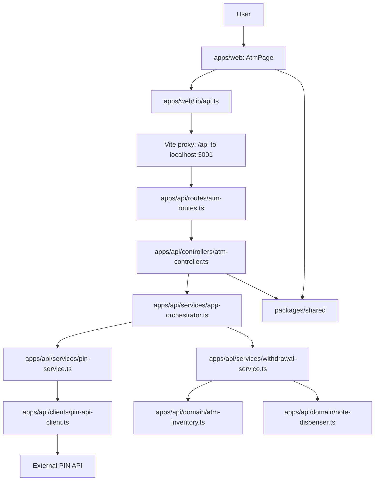

# ATM App Architecture

## Overview
This repository is a small TypeScript monorepo for an ATM application with three workspaces:

- `apps/web`: React + Vite frontend for entering a PIN, editing withdrawal amounts, and rendering session results.
- `apps/api`: Express API that validates requests, orchestrates the ATM session, and exposes health and ATM endpoints.
- `packages/shared`: Shared constants, Zod schemas, and TypeScript types used by both the API and the frontend.

The current codebase is implemented end-to-end for the ATM session flow. The web app, API wiring, external PIN API client, note-dispenser, withdrawal-processing logic, and automated tests are all in place.

## File Structure
```text
atm-app/
|-- apps/
|   |-- api/
|   |   |-- src/
|   |   |   |-- app.ts                    # Express app composition
|   |   |   |-- server.ts                 # API bootstrap
|   |   |   |-- clients/
|   |   |   |   `-- pin-api-client.ts    # External PIN API integration + response validation
|   |   |   |-- controllers/
|   |   |   |   |-- atm-controller.ts     # Request validation + response handling
|   |   |   |   `-- health-controller.ts  # Health endpoint
|   |   |   |-- domain/
|   |   |   |   |-- atm-inventory.ts      # In-memory note inventory
|   |   |   |   `-- note-dispenser.ts     # Exact note selection with deterministic tie-breaking
|   |   |   |-- lib/
|   |   |   |   |-- config.ts             # Environment/config parsing
|   |   |   |   `-- http-error.ts         # HTTP and not-implemented errors
|   |   |   |-- routes/
|   |   |   |   |-- atm-routes.ts         # /api/atm/session
|   |   |   |   `-- health-routes.ts      # /api/health
|   |   |   |-- services/
|   |   |   |   |-- app-orchestrator.ts   # Session orchestration
|   |   |   |   |-- pin-service.ts        # PIN auth wrapper
|   |   |   |   |-- withdrawal-service.ts # Withdrawal sequencing, overdraft checks, and inventory updates
|   |   |   |   `-- app-orchestrator.test.ts
|   |   |   |-- types/
|   |   |   |   `-- atm.ts                # API-side service contracts
|   |   |   `-- app.test.ts               # Basic API test
|   |   `-- package.json
|   `-- web/
|       |-- src/
|       |   |-- app/
|       |   |   `-- App.tsx               # Root app component
|       |   |-- components/
|       |   |   `-- Panel.tsx             # Shared presentation wrapper
|       |   |-- features/
|       |   |   `-- atm/
|       |   |       `-- AtmPage.tsx       # Main ATM UI
|       |   |-- lib/
|       |   |   `-- api.ts                # Frontend API client
|       |   |-- types/
|       |   |   `-- atm.ts                # Re-exported shared ATM types
|       |   |-- main.tsx                  # React entrypoint
|       |   `-- styles.css                # App styles
|       |-- vite.config.ts                # Dev server + /api proxy
|       `-- package.json
|-- docs/
|   |-- ARCHITECTURE.md                   # Technical architecture and flow
|   |-- DEVELOPMENT_FLOW.md               # Project evolution and decisions
|   `-- PLANS.md                          # Original implementation spec
|-- packages/
|   `-- shared/
|       |-- src/
|       |   |-- constants/
|       |   |   `-- atm.ts                # Denominations, defaults, limits, API URL
|       |   |-- schemas/
|       |   |   `-- atm.ts                # Zod request/response schemas
|       |   |-- types/
|       |   |   `-- atm.ts                # Shared domain and API types
|       |   `-- index.ts                  # Shared exports
|       `-- package.json
|-- README.md                             # Product overview and local workflows
|-- package.json                          # Workspace scripts
`-- tsconfig.base.json
```

## Runtime Flow


## Component Notes
- `apps/web` is a thin client. It manages form state, validates that withdrawal amounts are positive integers before submission, and renders the response returned by the API.
- `apps/api` uses composition in `app.ts` to wire the client, services, domain helpers, and routes together in one place.
- `atm-controller.ts` is the HTTP boundary. It validates the request body with `pinRequestSchema` from `@atm/shared` and delegates to the orchestrator.
- `app-orchestrator.ts` is the application-service layer. It authenticates the PIN, then passes the requested withdrawal array to the withdrawal service.
- `pin-api-client.ts` calls the external PIN API, maps `403` to invalid PIN, maps upstream/network failures to API errors, and validates the response body before returning a balance.
- `withdrawal-service.ts` processes withdrawals in order, stops on the first failure, enforces the `-100` overdraft floor, and updates ATM inventory after each success.
- `note-dispenser.ts` generates all exact note combinations available from current inventory and ranks them by evenness, note count, and denomination priority.
- `packages/shared` is the contract package. It keeps constants, schemas, and result types consistent across frontend and backend.

## Current Implementation Status
- Implemented: monorepo wiring, React UI, Express routing, shared request/response contracts, external PIN API integration, deterministic note dispensing, withdrawal sequencing, and endpoint/domain tests.
- In-memory state: ATM inventory is created in the API process and not persisted to a database.
- Local development: `apps/web/vite.config.ts` proxies `/api` requests to the Express server on port `3001`.
